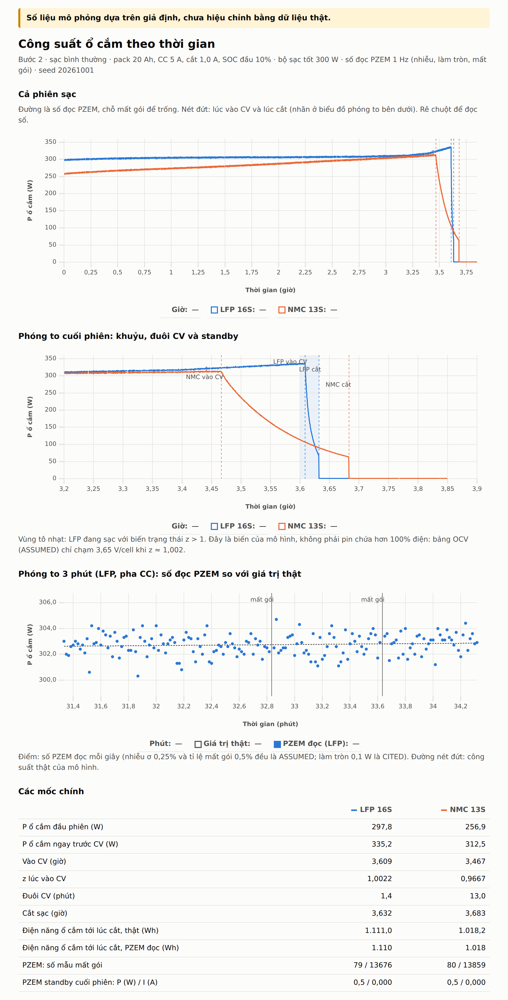

# SạcAn-Sim

Mô phỏng một phiên sạc xe máy điện lithium (LFP 16S, NMC 13S), xuất số liệu như PZEM đo ở ổ cắm.
Tài liệu gốc: `SPEC.md` và báo cáo `Mô phỏng sạc pin lithium.md` của người dùng.

> **Số liệu mô phỏng dựa trên giả định, chưa hiệu chỉnh bằng dữ liệu thật.**

## Chạy

```bash
npm install      # một lần
npm run dev      # mở web (biểu đồ công suất)
npm test         # chạy test (vitest)
```

## Cấu trúc

| Đường dẫn | Vai trò |
|---|---|
| `src/model.js` | Hàm thuần `step(state, params, dt)`: bộ sạc CC/CV + Ns cell 1RC (RC2 tùy chọn, mặc định tắt) |
| `src/simulate.js` | Chạy cả phiên, trả về cột `Float32Array` + các mốc (vào CV, cắt, Wh) |
| `src/params.js` | Đọc JSON, **từ chối tham số không có nhãn** CITED / DERIVED / ASSUMED |
| `src/pzem.js` | Lớp đo PZEM-004T: nhiễu, mất gói, ngưỡng, làm tròn, bộ đếm Wh (Bước 2) |
| `src/rng.js` | RNG có seed (mulberry32), mỗi tầng một luồng riêng |
| `src/ui/` | Trang biểu đồ uPlot |
| `params/*.json` | Tham số, mỗi giá trị có `value`, `unit`, `source`, `ref` |
| `test/` | Test: tính nhất quán với tài liệu, lớp đo PZEM, tái lập, nhãn tham số |
| `KNOWN_ISSUES.md` | **Việc đã biết**: chỗ mô hình lệch tài liệu hoặc dữ liệu thật |

## Tiến độ

- [x] **Bước 1**: sạc bình thường, chưa lỗi, chưa nhiễu. Test là *kiểm tra tính nhất quán với tài liệu, chưa phải kiểm chứng thực nghiệm*.
- [x] **Bước 2**: lớp đo PZEM (0,1 V / 0,001 A / 0,1 W / 0,01 PF / 1 Wh; nhiễu σ 0,25%, mất gói 0,5%, ngưỡng 0,4 W, 1 Hz)
- [ ] Bước 3: lỗi
- [ ] Bước 4: UI + CSV
- [ ] Bước 5: đối chiếu PyBaMM offline



## Quy ước quan trọng

- `z` (SOC trong mô hình) được phép vượt 1. Đây là **biến của mô hình, không phải vật lý**: với bảng OCV (ASSUMED),
  LFP chỉ chạm 3,65 V/cell ở z ≈ 1,002 khi sạc 5 A.
- "Giống từng bit" chỉ đúng trên cùng một engine JS. Giữa các trình duyệt hoặc với PyBaMM thì so có dung sai.
